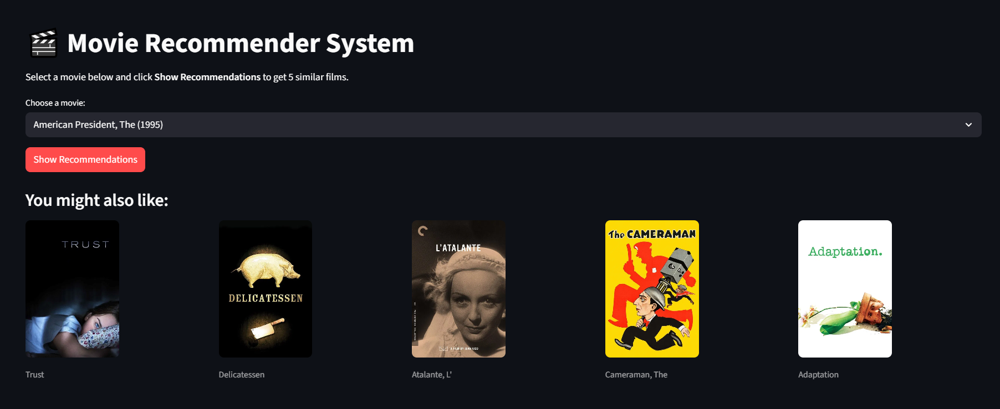
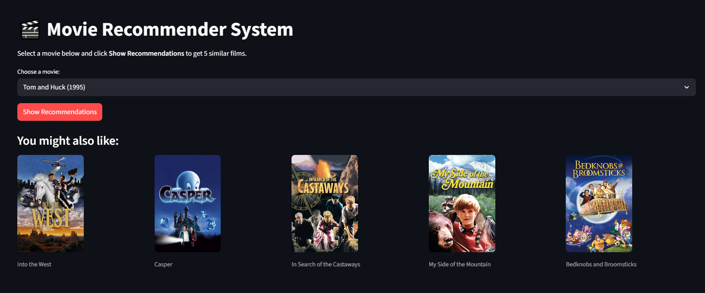

# 🎬 Movie Recommendation System

A content-based Movie Recommendation System built with **Python**, **Machine Learning**, and **Streamlit**. The application recommends movies similar to the selected movie and displays their posters using the TMDB API.

## Features

* Movie recommendation based on similarity
* Interactive Streamlit user interface
* TMDB poster integration
* Ratings dataset support
* Fast movie search and recommendation

## Technologies Used

* Python
* Pandas
* NumPy
* Scikit-learn
* Streamlit
* Pickle
* TMDB API

## Dataset

The project uses:

* `movies.csv`
* `ratings.csv`

to generate personalized movie recommendations.

## Project Structure

```text
Recommendation_System/
│
├── app.py
├── Movies_Recommeded.ipynb
├── movies.csv
├── ratings.csv
├── movies_list.pkl
├── similarity.pkl
└── README.md
```

## Output

### Movie Recommendation Interface



### Recommended Movies with Posters



## Note

The trained model files (`similarity.pkl` and `movies_list.pkl`) are very large in size and could not be uploaded to GitHub due to storage limitations. Therefore, these files are excluded from this repository.

## Future Improvements

* Collaborative Filtering
* Hybrid Recommendation System
* User Authentication
* Personalized Recommendations
* Cloud Deployment

